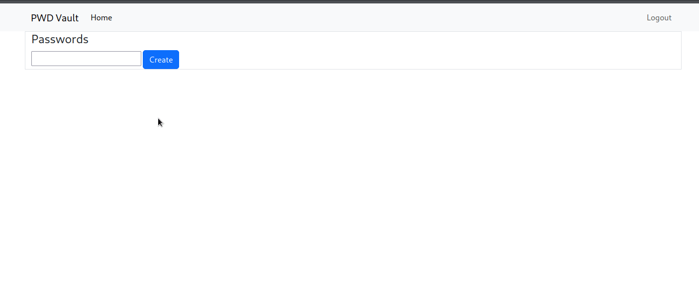

# password_vault

Study application, made using Flask and Boostrap.

Password Vault is a web application for storing passwords.

1 - To run the application, clone the repository and install the dependencies with a virtual environment of your choice.

`$ pip install -r requirements.txt`

2 - Create an `.env` file in the project root with a `SECRET_KEY = "YOUR SECRET KEY HERE"`

3 - Run:

`` $ python run` or `$ flask --app app run ``

  

